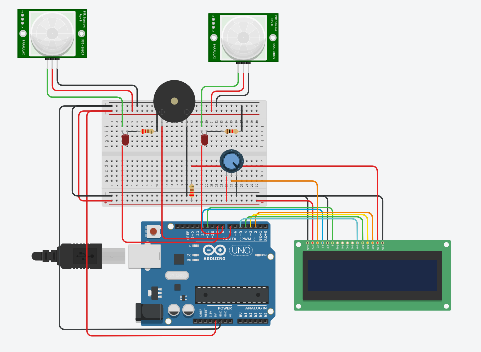
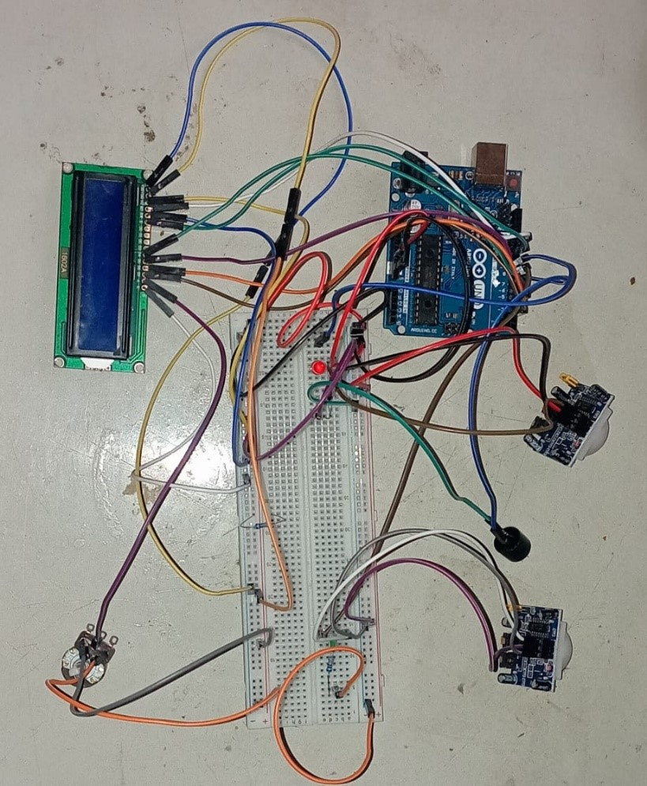

# Bidirectional Visitor Counter using Arduino

This project is a Bidirectional Visitor Counter, developed during my 1st year. The system uses two PIR (Passive Infrared) sensors to detect the entry and exit of visitors, and an LCD to display the current count. Additionally, a piezo buzzer is used for audio feedback when a visitor is detected.

## Features

- **Bidirectional Counting:** Counts visitors entering and exiting a room using two PIR sensors.
- **Real-time Display:** The current visitor count is displayed on a 16x2 LCD screen.
- **Audio Feedback:** A piezo buzzer sounds when a visitor is detected, with different tones for entry and exit.

## Technologies Used

- **Microcontroller:** Arduino
- **Sensors:** PIR Sensors
- **Output Devices:** 16x2 LCD, Piezo Buzzer
- **Programming Language:** C++ (Arduino IDE)

## Circuit Diagram

*Include or describe the circuit diagram here if available.*

## How to Use

1. **Clone the Repository:**
git clone https://github.com/Ruchith1018/Btech-1stYear.git

2. **Navigate to the Project Directory:**
cd Btech-1stYear/Bidirectional Visitor Counter using Arduino

3. **Upload the Code:**
- Open the `.ino` file in the Arduino IDE.
- Connect your Arduino to your computer via USB.
- Select the appropriate board and port from the Arduino IDE.
- Click "Upload" to transfer the code to the Arduino.

4. **Setup the Hardware:**
- Connect the PIR sensors, LCD, and piezo buzzer according to the circuit diagram.
- Power the Arduino and ensure all connections are secure.

5. **Run the Project:**
- As visitors pass through the sensors, the count will update on the LCD.
- The buzzer will sound different tones for entry and exit.

## Screenshots

### Designs

### Hardware Setup

*The above image shows the physical setup of the sensors, LCD, and piezo buzzer.*

## Example Output

- **Visitor enters:**
- LCD displays "Visitor entered"
- Visitor count increases by 1
- Buzzer plays a high tone

- **Visitor exits:**
- LCD displays "Visitor exited"
- Visitor count decreases by 1
- Buzzer plays a low tone

## Future Enhancements

- Add data logging to track visitor counts over time.
- Implement a reset button to manually reset the visitor count.
- Use wireless communication (e.g., Bluetooth) to send visitor data to a mobile device.

## Contributions

Contributions are welcome! If you have ideas for improvements or additional features, feel free to fork the repository and create a pull request.

## Contact

For any questions or suggestions, feel free to reach out:

- **Email:** bl.ruchith@gmail.com

